# "Listes à gogo 3/3"

> HTML exercise given at HEPL

* * *

**"Listes à gogo"** is an educational project, which will be used for `HTML` remedial courses.

**Note:** the school where the course is given, the [HEPL](http://www.provincedeliege.be/hauteecole) from Liège, Belgium, is a french-speaking school. From this point, the instruction will be in french. Sorry.

* * *

> Lors de vos cours de *web*, vous allez découvrir les langages HTML et CSS et les mettre en pratique pour apprendre à créer des pages web.  

* * *

## Listes à gogo 3/3

Vous trouverez dans ce dossier un fichier texte HTML nommé **index.html** ansi que six autres fichiers texte HTML dans le dossier **html**. Ce &laquo;&nbsp;mini-site&nbsp;&raquo; &laquo;&nbsp;Liste à gogo&nbsp;&raquo; est dédié aux listes HTML en les re-situant dans leur contexte et en présentant divers exemples.  

Les fichiers donnés correspondent à la solution de la partie 2 (disponible sur le branche &laquo;&nbsp;completed&nbsp;&raquo; de l'énoncé de la partie 2).

Il est donc tout à fait possible de réaliser cette partie 3 sans avoir fait la partie 2 (ni la partie 1).

Votre but lors de cette partie 2 sur 3 est 

	- de faire aboutir cette page web vers un outline (i.e. un plan de document) clair et identique sur tous les navigateurs (vocaux y compris)
	- de valider votre outline
	- d'utiliser le &laquo;&nbsp;HTML5 précis & concis&nbsp;&raquo;.
	
Une fois votre outline fini, il conviendra de valider vos fichiers et pour chaque erreur, il faudra non seulement la corriger, mais en plus utiliser le &laquo;&nbsp;précis & concis&nbsp;&raquo; pour vérifier et valider la correction de cette erreur.

Cet énoncé présente l'outline à obtenir, donne quelques infos (aides) pour y arriver et propose quelques erreurs à faire et à corriger via validateur et le &laquo;&nbsp;précis & concis&nbsp;&raquo;.

Dans la section **«&nbsp;Aide&nbsp;»** ci-dessous se trouve quelques rappels utiles concernant l'outline (concordance HTML4/5) et les balises sectionnantes. 

* * *

## Voici les 7 rendus des différentes pages une fois l'exercice terminé (et donc, l'outline donné étant respecté correctement).

### Rendu de index.html


### Rendu de bases.html

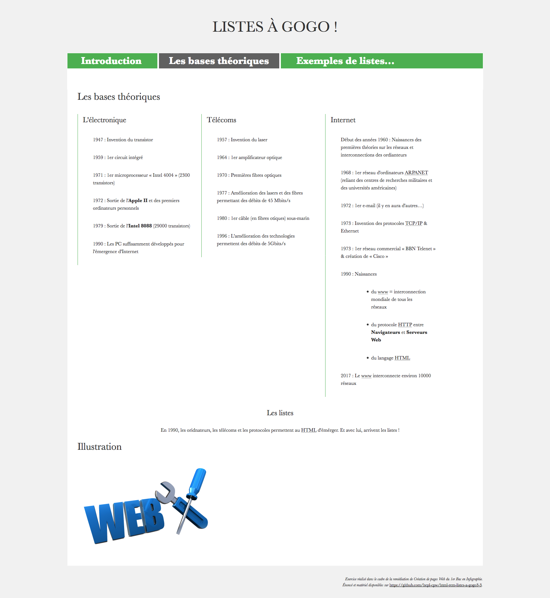

### Rendu de li_mains_poker.html

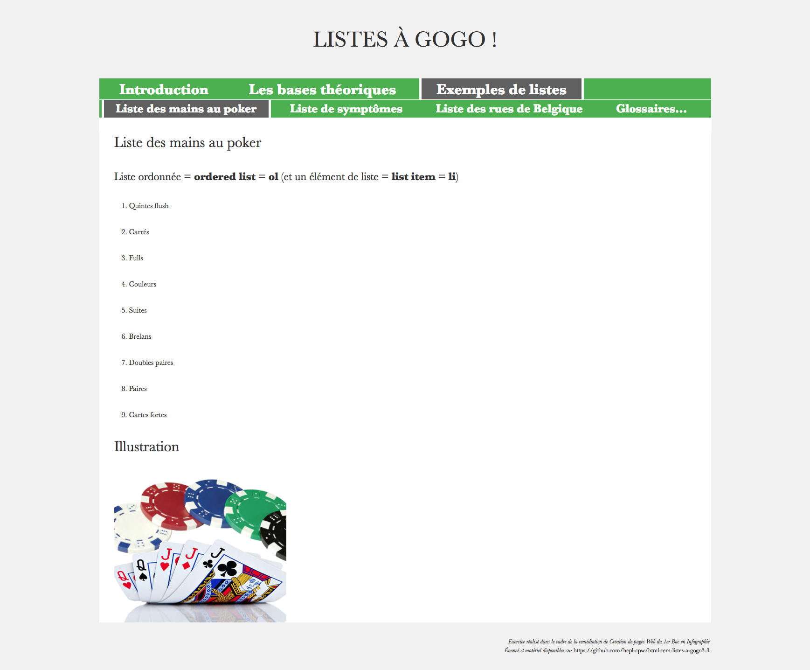

### Rendu de li_symptomes.html

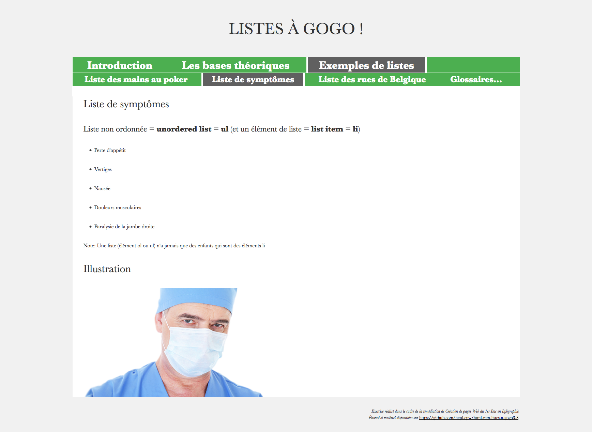

### Rendu de li_rues.html

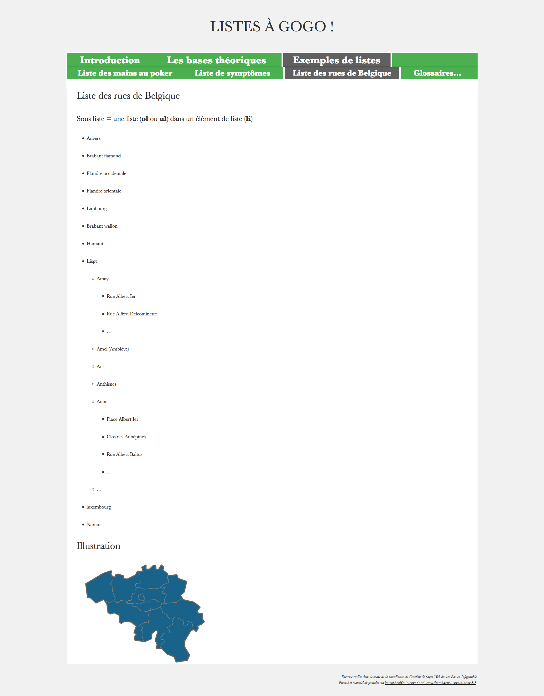

### Rendu de li_dfn_web.html


### Rendu de li_dfn_info.html

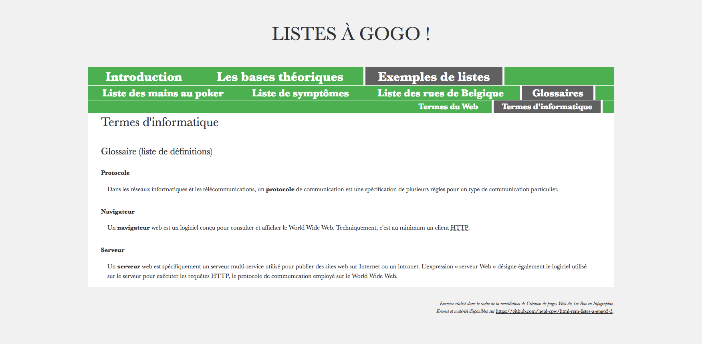

* * *

## Voici les 7 outlines (plans de documents) attendus

### Outline de index.html

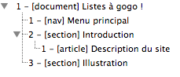

### Outline de bases.html

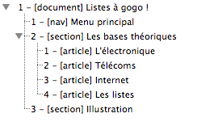

### Outline de li_mains_poker.html

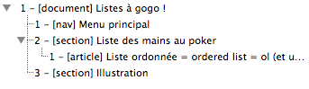

### Outline de li_symptomes.html


### Outline de li_rues.html

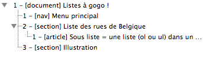

### Outline de li_dfn_web.html

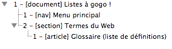

### Outline de li_dfn_info.html

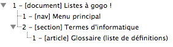
	

### Aide

#### Contexte et concordance des outline html4 et 5

Le HTML5 est censé conserver le HTML4. A savoir qu'un document HTML4 est aussi un document HTML5. Il est &laquo;&nbsp;rétro-compatible&nbsp;&raquo;.

Cela n'empêche pas qu'HTML5 ajoute des choses. Notamment, il rend explicite l'usage des sections, utilisés par les navigateurs pour établir les plans de documents.

Les plans de documents sont de véritables &laquo;&nbsp;tables des matières cachée&nbsp;&raquo; qui se cachent dans chaque document au sein de vos balises HTML4/5.

Un plan de document permet aux Internaute utilisant des navigateurs vocaux de s'y retrouver dans la page Web.

Or, une part importante de la qualité d'accessibilité d'une page Web réside dans la clarté de ce plan de document.

Des outils (comme **headings map** sur FireFox) permettent de les visualiser et c'est très utile, car on se rend compte immédiatement de la clarté ou non de la découpe de la page.

Pour l'HTML4 (et donc 5 aussi) les plans de documents sont construits sur bases de sections implicites qui sont construites via les niveaux de titres. Ainsi,
	- une balise `h1` ouvre une première section implicite qui se referme au prochain h1
	- une balise `h2` ouvre une sous-section implicite qui se referme au prochain h2
	- une balise `h3` ouvre une sous-sous-section implicite qui se referme au prochain h3
	- &hellip;

Par exemple&nbsp;:

```html
    <body>
    	<h1>Les Trolls</h1>
    	<p>
    		Un troll est un être de la mythologie nordique, incarnant les forces naturelles ou la magie, caractérisé principalement par son opposition aux hommes et aux dieux. Ce troll est souvent assimilé aux Jötunns, les « Géants » de cette mythologie.
    	</p>
    	<h2>Étymologie</h2>
    	<p>
    		Le mot « troll » apparaît dans la langue française au début du XVIIe siècle, quand Pierre Le Loyer évoque des esprits norvégiens appelés « Trollen » ou « Drolles ».
    	</p>
    	<h2>Folklore scandinave</h2>
    	<p>
    		Le troll du folklore concerne toutes les légendes et croyances populaires relatives au troll.
    	</p>
    	<h3>Troll et christianisation</h3>
    	<p>
    		Les anciens dieux et les rites paganistes ont été remplacés par des croyances pour de nouvelles créatures païennes : trolls, jötnars, elfes… Et parmi celles-ci, le troll était une créature très présente dans les légendes. Il était aussi le plus important opposant à la christianisation : « les forces du chaos, les ennemis de Dieu » sont ainsi symbolisées par le troll.
    	</p>
    	<h3>Évolution des croyances</h3>
    	<p>
    		Il est difficile de déterminer avec certitude l'évolution des légendes et croyances populaires, entre le Moyen Âge et l'Époque moderne, en l'absence de traces écrites suffisantes. Les spécialistes, historiens et folkloristes fondent leurs hypothèses à partir de l'étude philologique des textes littéraires norrois et ultérieurs.
    	</p>
    </body>
```

Conduit à ce plan de document&nbsp;:

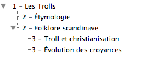

Qui est le même pour un navigateur HTML5 car il fonctionne toujours avec les sections implicites.

Par contre l'HTML5 introduit 4 nouvelles balises dites &laquo;&nbsp;sectionnantes&nbsp;&raquo; qui sont, assez logiquement&nbsp;:
	- `section` (une section de page) et `article` (un article au contenu autonome), mais aussi
	- `nav` (une section dédiée à la navigation) et `aside` (un section dédiée à de l'information complémentaire).

Ces balises ouvrent des sections (explicites) avec leurs balises d'ouvertures et referment ces sections avec leurs balises de fermetures.

La balise `body` est quant à elle une &laquo;&nbsp;racine de sectionnement&nbsp;&raquo; Cela veut dire que cette balise introduit une nouvelle section explicite mais elle n'est pas considérée comme sectionnante puisqu'on ne peut pas démarrer plusieurs sections avec `body` (étant donné que c'est une balise unique).

Attention, souvent amalgamée avec les 4 précédentes&nbsp;:
	- `header` (une en-tête) et `footer` (un pied de page),
sont en réalité des en-têtes et pieds de &laquo;&nbsp;pages&nbsp;&raquo; de la section courante (on devrait dire en-tête et pied de sections) mais n'introduisent pas de nouvelles sections&nbsp;! 

Dès lors, le HTML5, fort de ses sections rendues explicites, permet d'utiliser un simple `h1` en début de chaque section.

En travaillant avec des sections explicites, on n'a plus besoin des `h2`, `h3`, etc. qui permettent des sections implicites.

En HTML5, les niveaux de titres sont censés être gérés par les niveaux des sections explicites (un titre dans une sous-section est traité comme un sous-titre, etc.)

Par exemple, une solution possible serait de découper notre document avec des sections explicites comme-ceci&nbsp;: 


```html
    <body>
    	<header> <!-- (non sectionnante !) -->
	    	<h1>Les Trolls</h1>
	    	<p>
   				Un troll est un être de la mythologie nordique, incarnant les forces naturelles ou la magie, caractérisé principalement par son opposition aux hommes et aux dieux. Ce troll est souvent assimilé aux Jötunns, les « Géants » de cette mythologie.
	    	</p>
	    </header>
	    <main> <!-- (non sectionnante !) -->
	    	<section>
	   			<h1>Étymologie</h1>
   				<p>
   					Le mot « troll » apparaît dans la langue française au début du XVIIe siècle, quand Pierre Le Loyer évoque des esprits norvégiens appelés « Trollen » ou « Drolles ».
				</p>
   			</section>
   			<section>
		    	<h1>Folklore scandinave</h1>
   				<p>
   					Le troll du folklore concerne toutes les légendes et croyances populaires relatives au troll.
   				</p>
   				<article>
			    	<h1>Troll et christianisation</h1>
   					<p>
			    		Les anciens dieux et les rites paganistes ont été remplacés par des croyances pour de nouvelles créatures païennes : trolls, jötnars, elfes… Et parmi celles-ci, le troll était une créature très présente dans les légendes. Il était aussi le plus important opposant à la christianisation : « les forces du chaos, les ennemis de Dieu » sont ainsi symbolisées par le troll.
			    	</p>
			    </article>
			    <article>
			    	<h1>Évolution des croyances</h1>
   					<p>
   						Il est difficile de déterminer avec certitude l'évolution des légendes et croyances populaires, entre le Moyen Âge et l'Époque moderne, en l'absence de traces écrites suffisantes. Les spécialistes, historiens et folkloristes fondent leurs hypothèses à partir de l'étude philologique des textes littéraires norrois et ultérieurs.
   					</p>
   				</article>
    		</section>
    	</main>
    </body>
```

Ce qui conduit à ce plan de document&nbsp;:

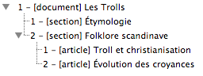

qui est censément le même que l'outline précédent (avec une numérotation différente, mais les niveaux de sections sont respectés) mais en plus, on trouve entre crochets le type de section (**document** pour la section racine, sinon soit **section**, soit **article**, soit **nav**, soit **aside**). 

...Par contre, avec cette nouvelle méthode, un navigateur HTML4 basé sur les sections implicites ne va prendre en compte que les numéros des titres... Et son plan de document va se trouver un peu... &laquo;&nbsp;raplapla&nbsp;&raquo;&nbsp;:

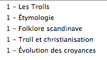

On peut par contre éviter ce problème (et il faut le faire) en *faisant correspondre les sections explicites du HTML5 avec les sections implicites du HTML4*&nbsp;!

Pour cela, il suffit de savoir dans quelle niveau de section explicite on se trouve, et faire correspondre ce niveau avec le numéro du titre (donc utiliser `h1` comme titre principale avec `body`, des `h2` comme titres de sous-sections explicites, des `h3` comme titres de sous-sous-sections explicites, etc.)

Reste à dire (et c'est logique) qu'une section sans titre est un problème d'accessibilité qu'il ne faut commettre sous aucun prétexte. Et on a toutes les clés en main pour faire des outlines parfaits&nbsp;!

Dans notre exemple, voici simplement la solution à notre problème précédent&nbsp;:

```html
    <body>
    	<header> <!-- (non sectionnante !) -->
	    	<h1>Les Trolls</h1>
	    	<p>
   				Un troll est un être de la mythologie nordique, incarnant les forces naturelles ou la magie, caractérisé principalement par son opposition aux hommes et aux dieux. Ce troll est souvent assimilé aux Jötunns, les « Géants » de cette mythologie.
	    	</p>
	    </header>
	    <main> <!-- (non sectionnante !) -->
	    	<section>
	   			<h2>Étymologie</h2>
   				<p>
   					Le mot « troll » apparaît dans la langue française au début du XVIIe siècle, quand Pierre Le Loyer évoque des esprits norvégiens appelés « Trollen » ou « Drolles ».
				</p>
   			</section>
   			<section>
		    	<h2>Folklore scandinave</h2>
   				<p>
   					Le troll du folklore concerne toutes les légendes et croyances populaires relatives au troll.
   				</p>
   				<article>
			    	<h3>Troll et christianisation</h3>
   					<p>
			    		Les anciens dieux et les rites paganistes ont été remplacés par des croyances pour de nouvelles créatures païennes : trolls, jötnars, elfes… Et parmi celles-ci, le troll était une créature très présente dans les légendes. Il était aussi le plus important opposant à la christianisation : « les forces du chaos, les ennemis de Dieu » sont ainsi symbolisées par le troll.
			    	</p>
			    </article>
			    <article>
			    	<h3>Évolution des croyances</h3>
   					<p>
   						Il est difficile de déterminer avec certitude l'évolution des légendes et croyances populaires, entre le Moyen Âge et l'Époque moderne, en l'absence de traces écrites suffisantes. Les spécialistes, historiens et folkloristes fondent leurs hypothèses à partir de l'étude philologique des textes littéraires norrois et ultérieurs.
   					</p>
   				</article>
    		</section>
    	</main>
    </body>
```

Ce qui conduit conduit à ce plan de document basé sur les titres (HTML4)&nbsp;:


qui est le même (même structure) que ce plan de document basé sur les éléments sectionnants (HTML5)&nbsp;:


### Validation

Une fois que vos plans de documents sont corrects, c'est-à-dire sans titres manquants et avec une même structure en sections pour les outlines HTML4 et les outlines HTML5, vous pouvez passer à la validation du vos fichiers.

Pour chaque erreur, il faudra consulter le précis et concis pour vérifier que ça concorde.

Lorsque c'est fait, voici encore quelques erreurs de validation à effectuer dans la page **index.html** pour s'entrainer à l'utilisation du précis et concis (et du validateur)&nbsp;:

- ajouter dans le `h3` une liste ordonnée avec un item &laquo;&nbsp;Bases&nbsp;&raquo; et un item &laquo;&nbsp;Exemples&nbsp;&raquo;&nbsp;;

- déplacer la liste ordonnée (&laquo;&nbsp;une rapide description de l'informatique et des techniques&hellip;&nbsp;&raquo;) dans le paragraphe qui le précède&nbsp;;

- déplacer le paragraphe &laquo;&nbsp;Bienvenue sur ce site présentant&nbsp;&raquo; comme premier enfant de la liste ordonnée qui le suit (donc juste avant le premier li de cette liste ordonnée)&nbsp;;

- ajouter une balise `hr` à la fin dans la balise `h3`.

- supprimer l'attribut `src` de la balise `img`.

- supprimer l'attribut `alt` de la balise `img`.

- faire un lien dans un lien&nbsp;: comme pour faire en sorte que le mot &laquo;&nbsp;github&nbsp;&raquo; du lien vers l'énoncé mène au site `www.github.com`.

Lorsque c'est fait, voici encore quelques erreurs de validation à effectuer dans la page **bases.html** pour s'entrainer à l'utilisation du précis et concis (et du validateur)&nbsp;:

- entourer d'un paragraphe (balise `p`) le texte &laquo&nbsp;er&nbsp;&raquo; d'une balise `sup`&nbsp;;

- enlever `<ol>` et `</ol>` de la liste qui suit la balise `<h3>L'électronique</h3>`&nbsp;;

* * *

Bon travail !